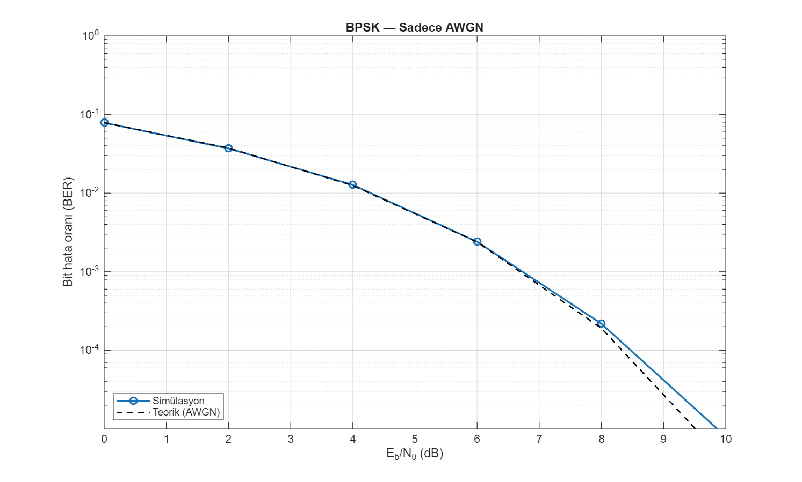

# MATLAB kablosuz iletişim örnekleri

Tek dosyalık MATLAB betikleri: **temel dijital iletişim simülasyonu**, **MathWorks toolbox dalga şekilleri** (5G NR, WLAN) ve **GNSS SDR veri hazırlığı**.

Her betik bağımsızdır; dosyayı açıp **F5** (Run) ile çalıştırmanız yeterlidir.

## Simülasyon çıktıları (grafikler)

---

### BPSK + AWGN — bit hata oranı (BER)
**Betik:** `wireless_bpsk_awgn_ornek.m`  
**Toolbox:** Gerekmez (temel MATLAB)  
**Parametreler:** 500 000 bit/ SNR noktası, Eb/N₀ = 0…12 dB, `rng(42)`



**Y ekseni:** bit hata oranı (BER, log ölçek). **X ekseni:** E_b/N₀ (dB).  
- **Mavi (Simülasyon):** BPSK modülasyon → AWGN kanal → eşik alıcı  
- **Siyah kesikli (Teorik):** AWGN için kapalı form BER = ½·erfc(√(Eb/N₀))

Eğriler üst üste biniyorsa simülasyon doğru kurulmuş demektir. `useRayleigh = true` ile düz Rayleigh sönümleme de denenebilir.

**Henüz eklenmemiş (toolbox gerekli):** QPSK, 802.11 WLAN, 5G NR — kurulunca `export_all_results` ile `results/` altına eklenir.

---

| Betik | Konu | Gerekli toolbox |
|-------|------|-----------------|
| `wireless_bpsk_awgn_ornek.m` | BPSK modülasyon, AWGN kanal, BER eğrisi; isteğe bağlı düz Rayleigh | Yok (temel MATLAB) |
| `comm_toolbox_qpsk_awgn_ornek.m` | QPSK, `comm.AWGNChannel`, `comm.ErrorRate`, takımyıldız grafiği | Communications Toolbox |
| `wlan_nonht_waveform_ornek.m` | 802.11 Non-HT (legacy) PHY, AWGN, zaman/spektrum | WLAN Toolbox |
| `nr_downlink_waveform_ornek.m` | 5G NR aşağı bağlantı: SSB, PDCCH, PDSCH, CSI-RS | 5G Toolbox |
| `prepare_gnss_sdr_data.m` | JKS 1-bit GPS ham kaydını SoftGNSS için int8 akışına çevirme | SoftGNSS `unpack_jks_1bit_to_int8` (üst projede) |

## Hızlı başlangıç

1. MATLAB **Current Folder** olarak bu repoyu (veya klonladığınız klasörü) seçin.
2. Toolbox gerektiren betiklerde ilgili toolbox yüklü değilse `assert` satırı net bir hata verir.
3. İstediğiniz `.m` dosyasını çalıştırın.

### BPSK / QPSK (BER)

- `wireless_bpsk_awgn_ornek.m` — Toolbox olmadan öğrenme amaçlı; simülasyon + teorik AWGN eğrisi.
- `comm_toolbox_qpsk_awgn_ornek.m` — Üretim tarzı sistem nesneleri (`pskmod`, `pskdemod`, `comm.AWGNChannel`).

Parametreler dosya başında: `EbNo_dB`, `numBits` / `frameLength`, `useRayleigh` (BPSK).

### 5G NR ve WLAN dalga şekilleri

- `nr_downlink_waveform_ornek.m` — FR1, 40 MHz, kısa süre (`NumSubframes = 4`); daha uzun dalga için `NumSubframes` artırın.
- `wlan_nonht_waveform_ornek.m` — 20 MHz, MCS 3; `cfg.MCS` ve `ChannelBandwidth` ile oynanabilir.

Çıktı: zaman genliği, (WLAN için) periodogram; NR için `info` yapısında ızgara/kanal ayrıntıları.

### GNSS SDR veri hazırlığı

`prepare_gnss_sdr_data.m` şunları bekler:

```
matlab-wireless-comm-examples/
  prepare_gnss_sdr_data.m
  GNSS_signal_records/
    gps.samples.1bit.I.fs5456.if4092.bin   ← JKS örnek kayıt
    unpack_jks_1bit_to_int8.m              ← SoftGNSS / GNSS_SDR tarafı
```

Ham dosya yoksa betik indirme adresini hatırlatır. Dönüşüm sonrası çıktı: `GNSS_signal_records/gps_jks_int8.bin` (~450 MB). Ardından `GNSS_SDR-master` içinde `init` ile SoftGNSS işlem hattına geçilir.

Bu repo yalnızca hazırlık betiğini içerir; **GNSS_SDR-master** ve ham kayıtlar ayrı klasörlerde tutulmalıdır (GitHub’a büyük `.bin` dosyaları eklenmez).

## GitHub'a yükleme (MATLAB → sonuç → push)

| Adım | Ne yapılır |
|------|------------|
| 1 | MATLAB'te betiği çalıştır |
| 2 | `save_github_figure(gcf, 'dosya_adi')` → `results/dosya_adi.png` |
| 3 | PowerShell: `.\push_to_github.ps1 -Message "aciklama"` |

**Repoya giren:** `.m` kodu, `results/*.png`, README  
**Repoya girmeyen:** `.mat`, `.bin`, ham IF, `*.fig` (`.gitignore`)

Örnek: `wireless_bpsk_awgn_ornek.m` çalışınca otomatik `results/bpsk_ber_awgn.png` üretir.

## İlişkili repolar

- [gnss-spoofing-research](https://github.com/Alp2246/gnss-spoofing-research) — GNSS spoofing tespiti (MATLAB)
- [matlab-fmcw-isac-examples](https://github.com/Alp2246/matlab-fmcw-isac-examples) — FMCW radar ve ISAC/OFDM örnekleri

## Lisans

Örnek betikler eğitim/araştırma amaçlıdır. Üçüncü taraf toolbox ve veri setleri kendi lisanslarına tabidir (MathWorks, JKS GPS örnek kayıtları vb.).
